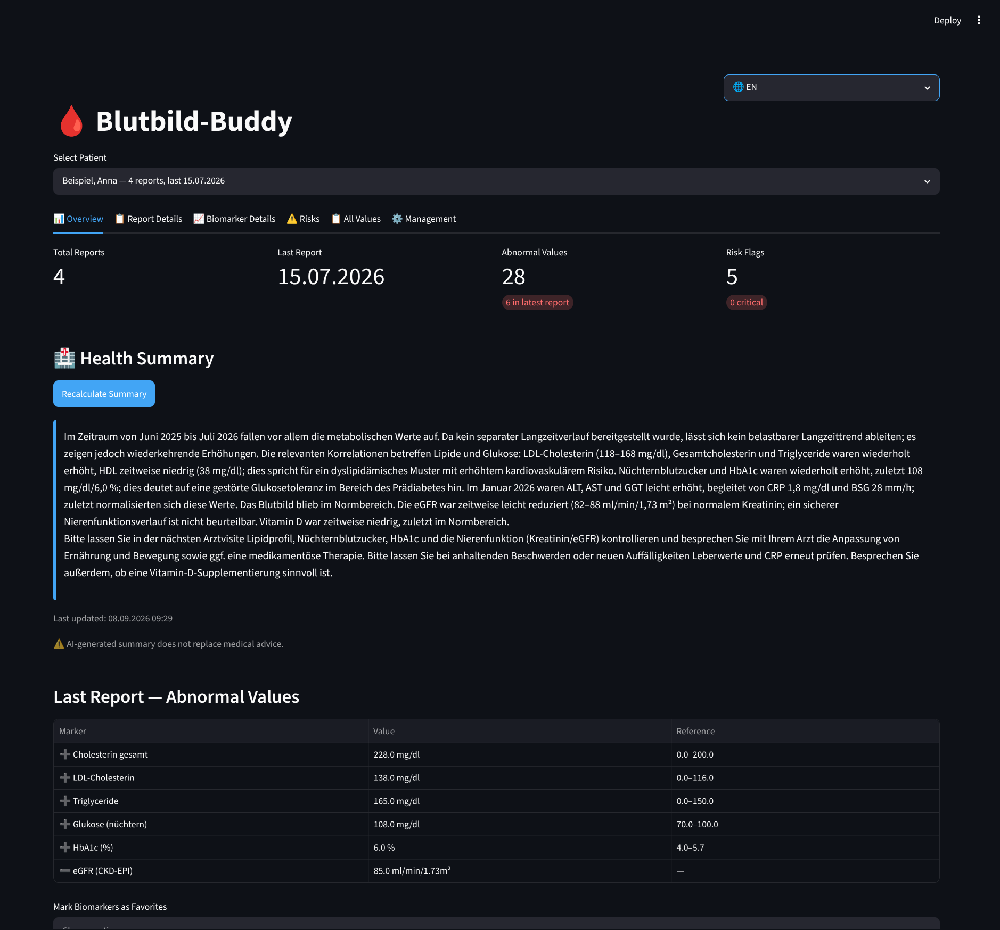
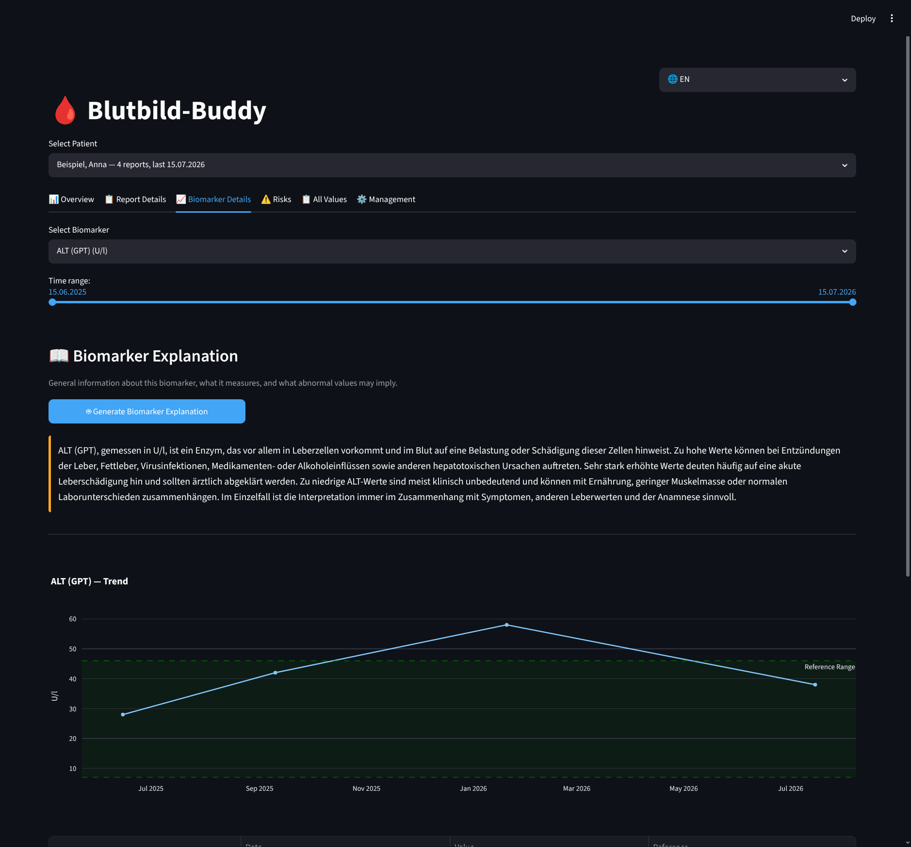
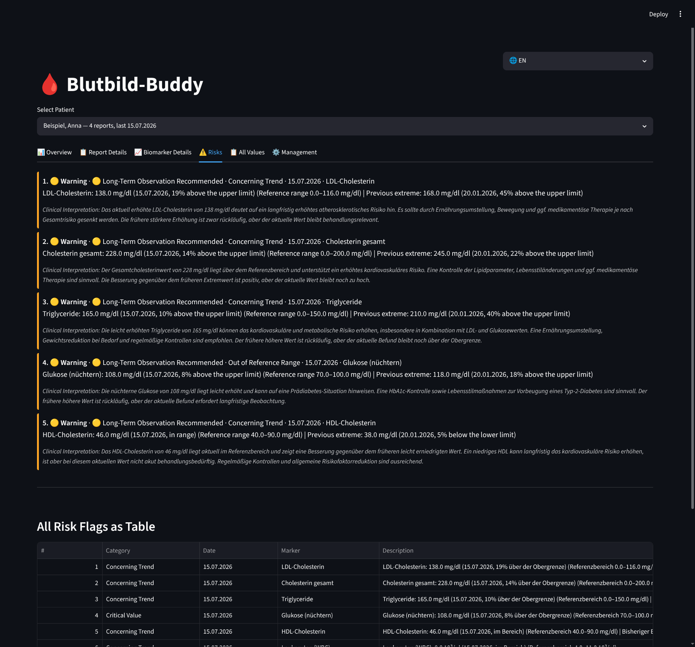

# 🩸 Blutbild-Buddy

> **This project was vibe-coded.** It works, but treat it like a prototype — not medical advice, not production software.

---

A Streamlit web app for analyzing blood-test / lab reports (PDFs). It extracts biomarker data from PDF page images using a local LLM, normalizes names to a canonical list, tracks trends over time, and flags risks — all persisted in a local SQLite database.

The app is built around **German** lab reports: the biomarker registry, aliases, and default reference ranges are German-centric. Extraction itself is language-agnostic (names are captured exactly as printed), and the UI is available in both German and English.

## Features

- **PDF extraction** — Upload lab report PDFs via the in-app file uploader (or drop them into `reports_input/`) and process them. The app renders each page to an image, sends it to a local LLM (OpenAI-compatible), and extracts structured biomarker data.
- **Name normalization** — Extracted biomarker names are mapped to canonical names from a built-in master list. You can rename or merge variants later.
- **Trend charts** — Interactive Plotly line charts showing any biomarker's values over time, with reference ranges overlaid.
- **Risk flag engine** — Detects critical values, concerning trends, volatility, missing markers, and improvements. Flags are severity-ranked and deduplicated per biomarker.
- **Health summaries** — The LLM generates a natural-language health summary for each patient based on their data history.
- **Biomarker mapping & merging** — Rename canonical names, auto-detect variant groups (LLM-suggested), and merge them — or merge manually.
- **Multi-language UI** — German and English, switchable in the sidebar.
- **Deduplication** — PDFs are skipped if their SHA-256 hash already exists in the database.

## Screenshots

The screenshots below show a single fictional patient with four lab reports over time (generated by `generate_demo_pdfs.py`).

### Overview

Stat cards, an LLM-generated health summary, and the abnormal values from the latest report.



### Biomarker Details

Per-biomarker trend chart with reference range overlaid, plus an LLM-generated explanation of what the marker measures.



### Risks

Severity-ranked risk flags (out-of-range values, concerning trends, cross-biomarker patterns), each with a clinical interpretation.



## Architecture

| File | Role |
|------|------|
| `app.py` | Streamlit UI — sidebar, data tabs (overview / detail / trends / risks / all values) + management tabs (reports / patients / LLM settings / LLM jobs / biomarker mapping), session state management |
| `llm_jobs.py` | Background LLM job queue: worker threads for long-running ops, kind locks, config snapshots, progress persistence |
| `extractor.py` | PDF pipeline: hash check → image render → LLM extraction → normalize → DB insert |
| `analyzer.py` | Risk flag engine: out-of-range, trending, volatility, missing markers |
| `llm_client.py` | OpenAI-compatible client calls (extract + normalize + summarize), embedded system prompts |
| `pdf_processor.py` | pypdfium2 → JPEG images, base64 encoding, SHA-256 hashing |
| `database.py` | SQLAlchemy models: `Patient → Report → DataPoint → RiskFlag` |
| `schemas.py` | Pydantic models for LLM JSON responses |
| `config.py` | Paths, LLM endpoint, canonical biomarker list, risk thresholds |
| `translations.py` | DE/EN translation dictionaries and helpers |

## Quick start

### Option 1: Docker (recommended for server deployment)

```bash
# 1. Create a .env file with your LLM settings
cat > .env << EOF
LLM_BASE_URL=http://localhost:8888/v1
LLM_MODEL=unsloth/Qwen3.6-35B-A3B-MTP-GGUF
LLM_API_KEY=your-api-key-here
LLM_TIMEOUT=300
EOF

# 2. Build and start
docker compose up -d

# 3. Open http://localhost:8501
```

All data (database + uploaded PDFs) persists in Docker named volumes (`blutbild-data`, `blutbild-reports`). To stop: `docker compose down`. To restart: `docker compose up -d`.

> **Note:** The Docker Compose defaults are `LLM_BASE_URL=http://172.17.0.1:8888/v1` (Docker bridge network), `LLM_MODEL=unsloth/Qwen3.8-27B-GGUF:UD-Q4_K_M`, and `LLM_TIMEOUT=300`. Override any of these in your `.env` file as shown above.

### Docker specifics
- **Security**: `no-new-privileges:true`, resource limits (4G max / 512M reserved)
- **Health check**: HTTP health probe on `/_stcore/health` every 30s
- **Volumes**: Named volumes for database (`blutbild-data`) and PDFs (`blutbild-reports`)
- **Streamlit config**: Dark theme, headless mode, file watcher disabled

### Option 2: Local (virtual environment)

```bash
# 1. Set up a virtual environment
python -m venv .venv && source .venv/bin/activate && pip install -r requirements.txt

# 2. Configure your LLM endpoint via environment variables or the app's ⚙️ Settings dialog
#    Default: http://localhost:8888/v1 (Unsloth / vLLM / any OpenAI-compatible server)

# 3. Upload German lab report PDFs using the file uploader in the app sidebar

# 4. Launch the app
streamlit run app.py
```

> **Note:** The app now includes a built-in file uploader — no need to manually place PDFs in `reports_input/`.

## Requirements

| Package | Purpose |
|---------|---------|
| `streamlit` | UI framework |
| `pypdfium2` | PDF → page image rendering (BSD, bundles Apache-2.0 PDFium) |
| `fpdf2` | Demo PDF generation (LGPL-3.0, used unmodified as a separate library) |
| `openai` | LLM API client (OpenAI-compatible) |
| `SQLAlchemy` | Database ORM |
| `pandas` | Data manipulation |
| `plotly` | Interactive charts |
| `pydantic` | JSON schema validation for LLM responses |
| `Pillow` | Image processing (PDF page → JPEG) |
| `python-dotenv` | Loads `.env` into the environment at startup |
| `openpyxl` | XLSX export (All Values tab) |

> **Version pin:** `streamlit==1.58.0` is pinned together with `starlette==1.3.1`. Newer Starlette requires a `thread_minimum_size` argument that this Streamlit version doesn't pass, so keep the pair in lockstep.

## LLM Configuration

The app requires an OpenAI-compatible LLM endpoint. Configure it via environment variables (Docker) or via the ⚙️ Settings dialog in the sidebar:

| Env Var | Default | Description |
|---------|---------|-------------|
| `LLM_BASE_URL` | `http://localhost:8888/v1` | Your Unsloth / vLLM / Ollama endpoint |
| `LLM_MODEL` | `unsloth/Qwen3.6-35B-A3B-MTP-GGUF` | Model name the endpoint expects |
| `LLM_API_KEY` | *(empty)* | API key for the LLM endpoint |
| `LLM_TIMEOUT` | `300` | Max wait time in seconds per LLM request |

### Docker deployment

For LAN deployment, set the env vars in your `.env` file or inline:

```bash
LLM_BASE_URL=http://192.168.1.100:8888/v1 LLM_API_KEY=your-key docker compose up -d
```

The in-app Settings dialog (⚙️) lets you change these at runtime — changes persist until the container restarts.

## Database

All data is stored in `data/blutbild_buddy.db` (SQLite). The schema is:

```
Patient (id, name, name_normalized, favorites)
  └── Report (id, patient_id, filename, file_hash, report_date, panel_type, raw_text)
        ├── DataPoint (id, report_id, canonical_name, original_name, value, unit, ref_low, ref_high, is_abnormal, is_disabled)
        └── RiskFlag (id, report_id, data_point_id, category, severity, rank, description, explanation)

BiomarkerRegistry (id, name, units, aliases, ref_low, ref_high, ref_unit, source)   # canonical list + LLM/manual overrides
PatientSummary (id, patient_id, report_id, summary_text)                           # per-patient health summary
BiomarkerInfo (id, patient_id, canonical_name, description, interpretation)        # per-patient biomarker notes
LlmJob (id, kind, label, status, progress_*, params_json, result_text, error, aborted, config_json)
DataQualityFinding (id, ...)                                                       # data-quality check findings
```

## Biomarker Coverage

The canonical list in `config.py` covers ~94 biomarkers across these categories:

- **Blutbild** (CBC) — WBC, RBC, Hb, Hkt, MCH, MCHC, MCV, PLT, granulocytes
- **Eisen & Vitamine** — Ferritin, Eisen, Transferrin, B12, Vitamin D, Folate
- **Lipidstatus** — Total HDL LDL cholesterol, triglycerides, Lp(a)
- **Leberwerte** — ALT, AST, GGT, ALP, bilirubin, protein, albumin
- **Nierenwerte** — Creatinine, urea, uric acid, eGFR, cystatin C
- **Elektrolyte** — Na, K, Ca, Mg, Cl, phosphate
- **Schilddrüse** — TSH, fT3, fT4, TPO-Ab, TRAK
- **Entzündung** — CRP, ESR, IL-6, TNF-alpha
- **Blutzucker / Diabetes** — Glucose, HbA1c, insulin, HOMA
- **Herz & Gefäße** — Homocysteine, CK, troponin, NT-proBNP, fibrinogen, D-dimers
- **Hormone** — Cortisol, testosterone, estradiol, progesterone, SHBG, LH, FSH, prolactin
- **Urin** — pH, specific gravity, protein, glucose, ketones, bilirubin, urobilinogen, nitrite, leukocytes

Custom biomarkers can be added through the UI and are persisted in the database.

## Tests

```bash
python test_blutbild_buddy.py
```

Tests use `unittest` and mock LLM calls for the extractor and analyzer tests.

## License

MIT — see [LICENSE](LICENSE). Free to use, modify, and share; attribution in the copyright notice is appreciated.

## Disclaimer

**Blutbild-Buddy is a personal tool, not a medical device.** It does not provide medical advice. All AI-generated summaries and risk interpretations are informational only. Always consult a qualified healthcare professional for medical decisions.
